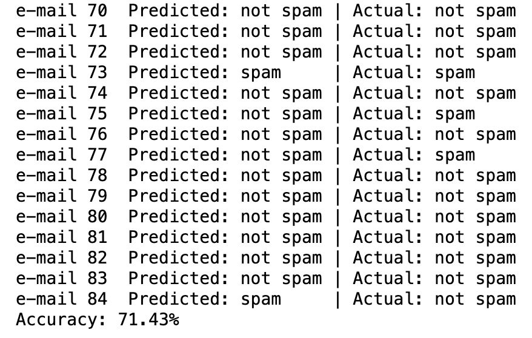
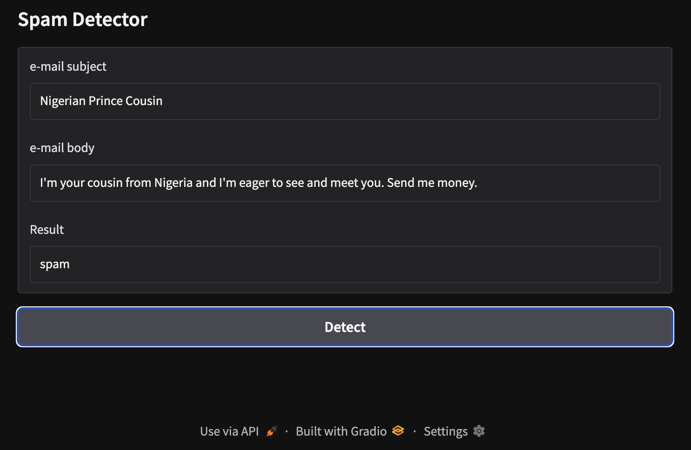
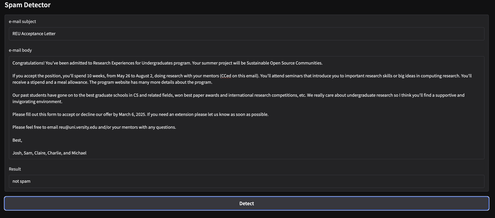

# Spam Detection Classification using OpenAI's gpt models



This project is designed to detect spam emails using an AI model. It includes a Jupyter Notebook (`spamDetection.ipynb`) and requires certain dependencies listed in `requirements.txt`.

## 📌 Setup Instructions

Follow these steps to set up your environment and run the project.

### 1️⃣ Install Conda (if not installed)
If you don’t have Conda installed, download and install it from:  
🔗 [Miniconda](https://docs.conda.io/en/latest/miniconda.html) or [Anaconda](https://www.anaconda.com/products/distribution)

### 2️⃣ Create a Conda Virtual Environment
Run the following command to create and activate a new Conda environment:

```
conda create --name spam-detection python=3.10 -y
conda activate spam-detection
```

### 3️⃣ Install Required Packages
Install all dependencies from `requirements.txt`:

```
conda install --file requirements.txt
```

> **Note:** If any package is missing from Conda, install it using `pip`:
> 
> ```
> pip install -r requirements.txt
> ```

### 4️⃣ Launch Jupyter Notebook
Run the following command to start Jupyter Notebook:

```
jupyter notebook
```

Then, open `spamDetection.ipynb` and run the cells.

## 📂 Project Files
- **`.gitignore`** - Specifies files to ignore in Git (e.g., environment files, cache, etc.).
- **`requirements.txt`** - Lists all required Python packages.
- **`spamDetection.ipynb`** - Jupyter Notebook containing the spam detection logic.

## ✅ Notes
- If you encounter missing module errors, try reinstalling dependencies with:

  ```
  pip install -r requirements.txt
  ```

- Ensure your OpenAI API key is set up correctly in a `.env` file.
  ```
  OPENAI_API_KEY=your-api-key-here
  OPENAI_API_BASE=your-api-base-here  # Optional if using the default OpenAI endpoint  
  ```

